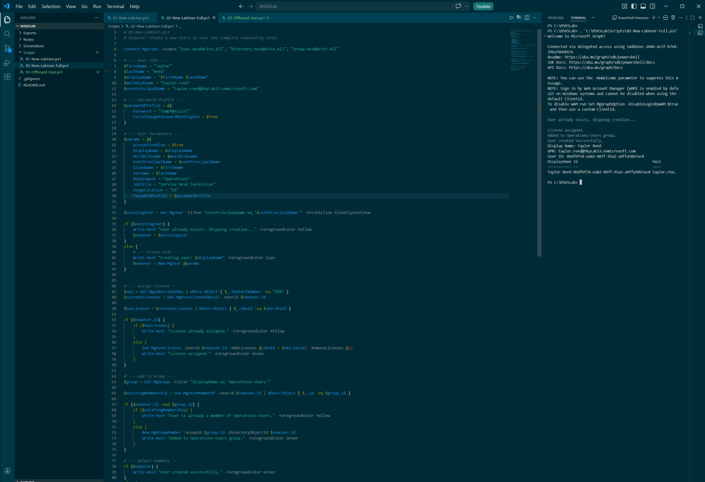
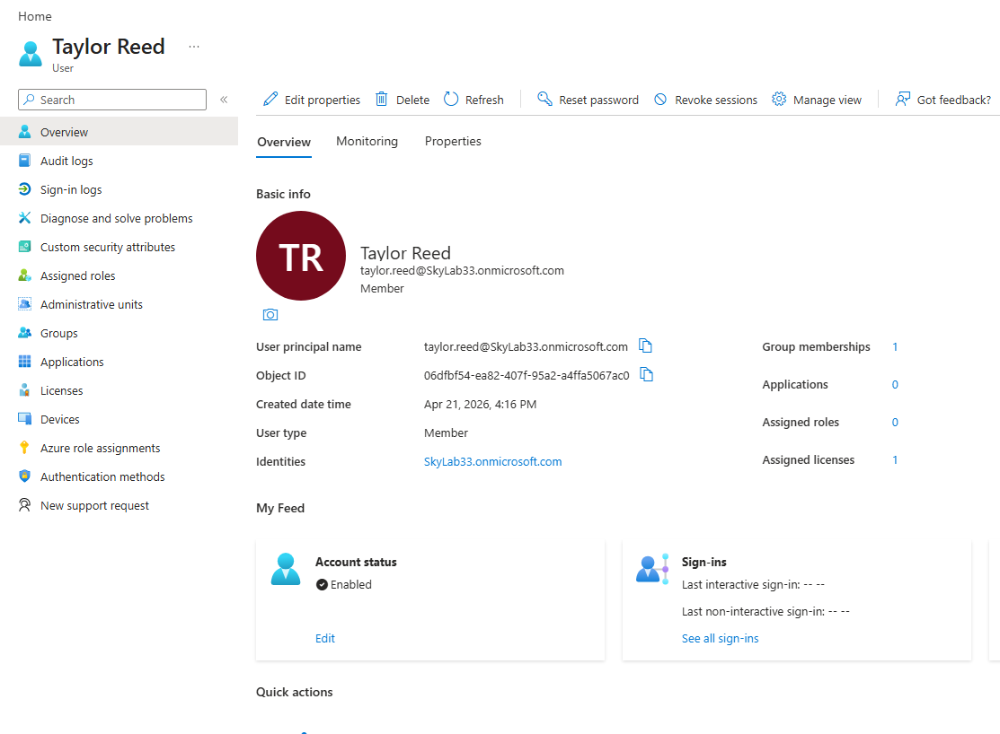
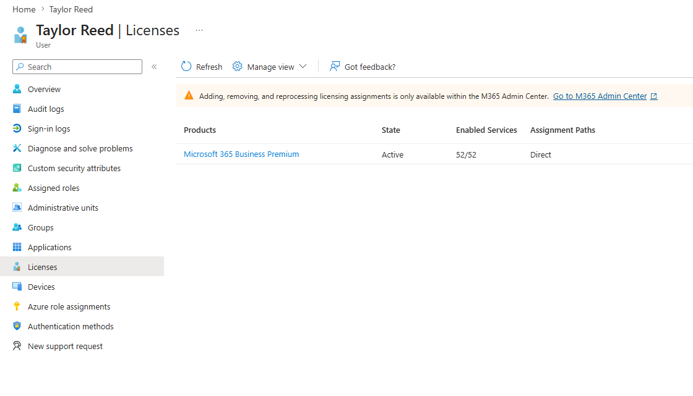
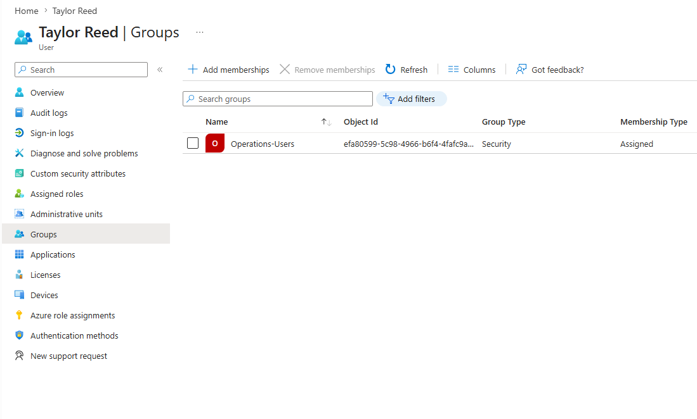
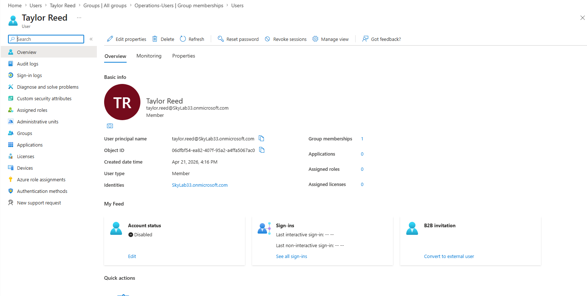
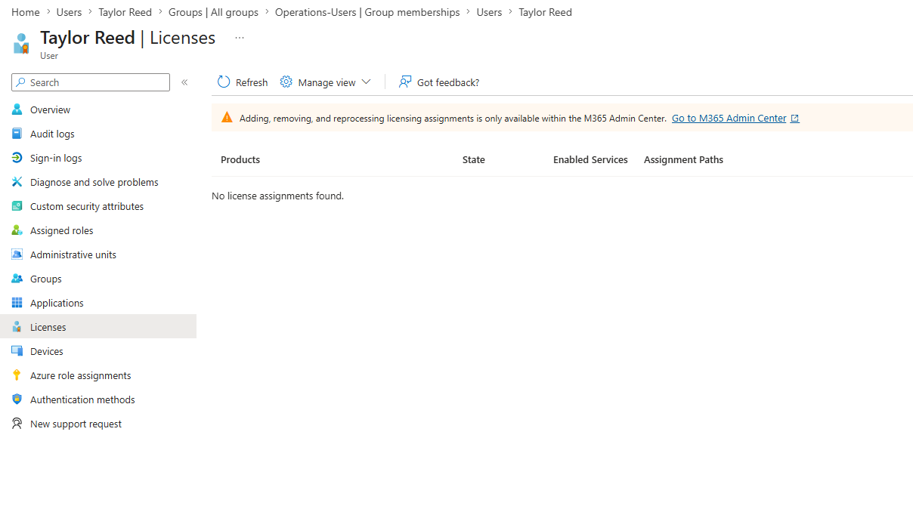
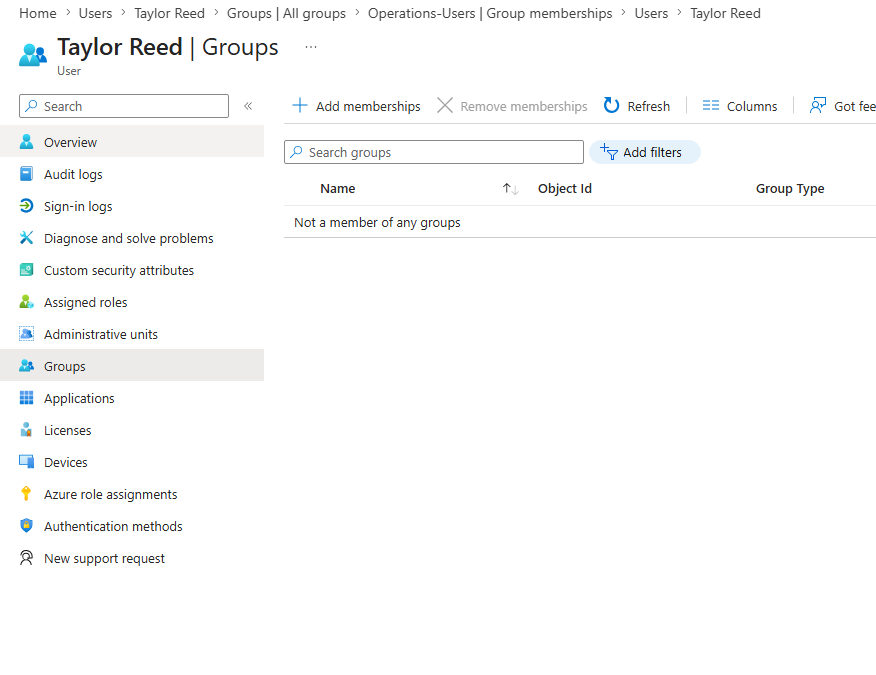

# M365 Lifecycle Automation Lab

This lab demonstrates a mini end-to-end IT administration workflow using:

- Microsoft 365  
- Microsoft Entra ID  
- Intune  
- PowerShell  
- Microsoft Graph  

---

## Scope

- User onboarding  
- Identity and access management  
- Group-based access control  
- License assignment  
- Intune managed device visibility  
- Compliance review  
- Offboarding workflow  

---

## Goal

Simulate the employee lifecycle across identity, access, device readiness, compliance, and offboarding in a real M365 lab environment.

---

## End-to-End Lifecycle Walkthrough

### 1. User Onboarding Script (PowerShell)

Creates a new Entra ID user with standardized attributes and secure password configuration.

---

### 2. User Created in Entra ID

Confirms successful identity creation in Microsoft Entra ID.

---

### 3. License Assigned (Microsoft 365 Business Premium)

Automatically assigns M365 license using Microsoft Graph PowerShell.

---

### 4. Group-Based Access Assigned

Adds user to a security group (`Operations-Users`) to simulate role-based access control.

---

### 5. Offboarding Script (PowerShell)

Handles secure user deprovisioning via automation.

---

### 6. Account Disabled

Disables the user account to immediately revoke sign-in access.

---

### 7. License Removed

Removes assigned licenses to reclaim resources and reduce cost.

---

### 8. Group Membership Removed

Removes user from all security groups to eliminate access paths.

---

## Scripts

| Script | Purpose |
|------|--------|
| `01-New-LabUser.ps1` | Basic user creation |
| `02-New-LabUser-Full.ps1` | Full onboarding (user + license + group) |
| `03-Offboard-User.ps1` | Offboarding automation |

---

## Key Concepts Demonstrated

- Microsoft Graph PowerShell SDK usage  
- Idempotent scripting (safe re-runs)  
- Group-based access control (RBAC)  
- License lifecycle management  
- Identity lifecycle automation  
- Real-world IT onboarding/offboarding workflows  

---

## Why This Matters

This project simulates what IT administrators and identity engineers do daily:

- Provision users quickly and consistently  
- Assign access based on role, not manually  
- Maintain security during employee transitions  
- Automate repetitive tasks to reduce human error  

---

## Future Enhancements

- Department and job title automation  
- Manager assignment  
- Dynamic group membership  
- Intune device enrollment automation  
- Conditional access policies  
- Logging and reporting (audit trail)

---

## Author

Skyler Blood 

